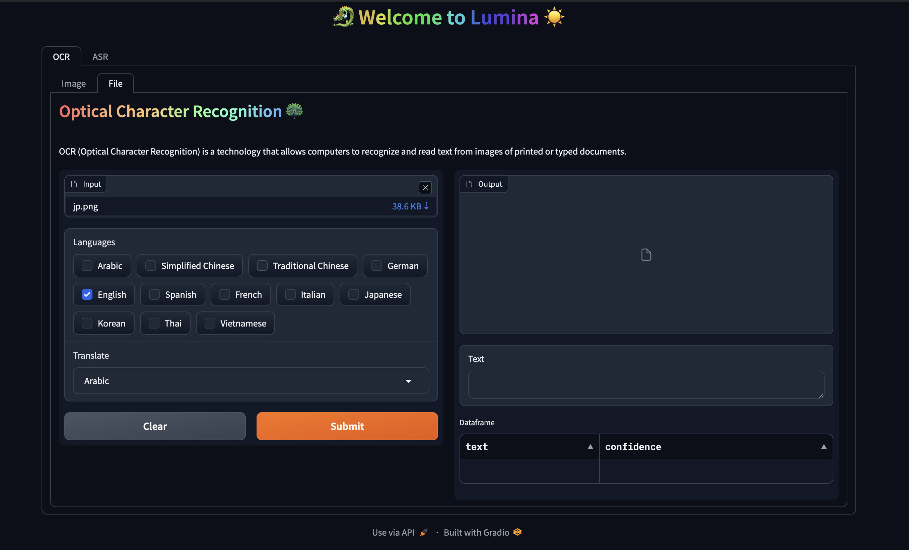
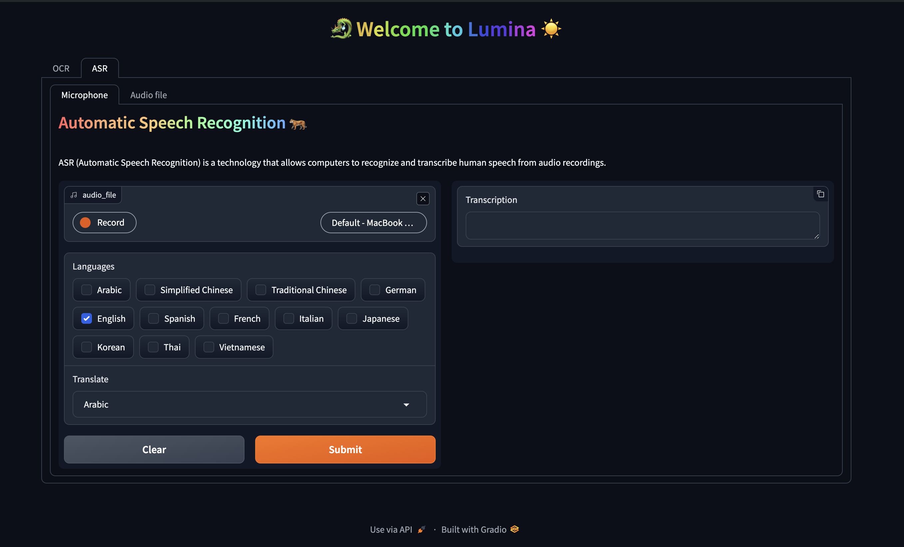
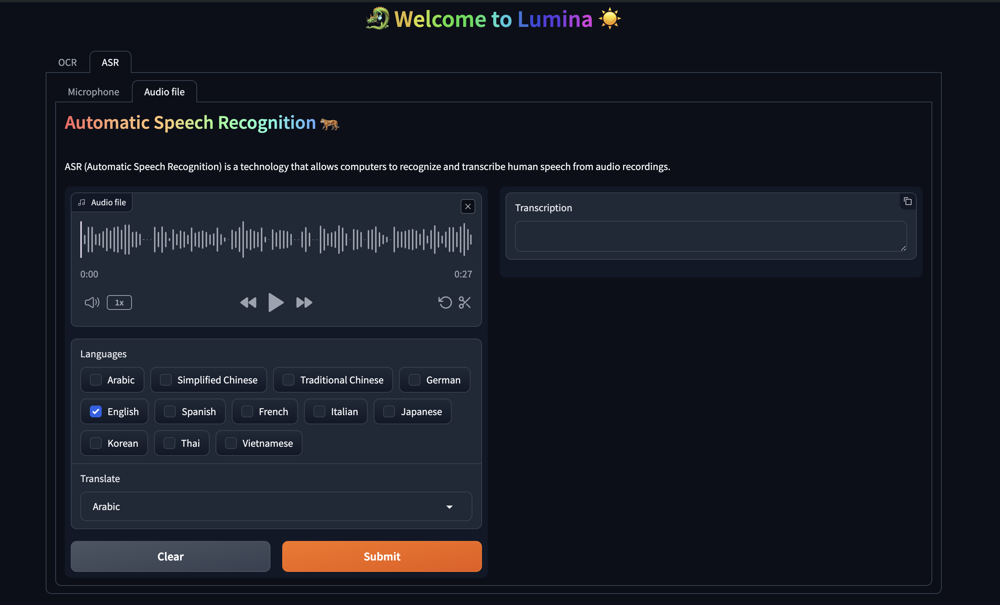

<h1 style="text-align:center"><strong>🐉 Lumina ☀️</strong></h1>

Lumina is a versatile tool designed to facilitate translation and note-taking across different languages. Whether you're dealing with text or audio, Lumina's OCR (Optical Character Recognition) and ASR (Automatic Speech Recognition) capabilities make it easy to transcribe, translate, and take notes in multiple languages.

## Features

### OCR (Optical Character Recognition)

Lumina's OCR feature allows you to extract text from various sources such as images, scanned documents, or screenshots. Once the text is extracted, Lumina can translate it into your preferred language and help you capture important notes associated with the content.


*Demo image input*


*Demo file input*

### ASR (Automatic Speech Recognition)

With Lumina's ASR feature, you can transcribe audio recordings from different sources, including recorded conversations, lectures, or interviews. The transcribed text can then be translated into different languages, and you can add relevant notes to organize and summarize the content.


*Demo microphone input*


*Demo audio file input*

## Installation

```bash
Coming soon!
